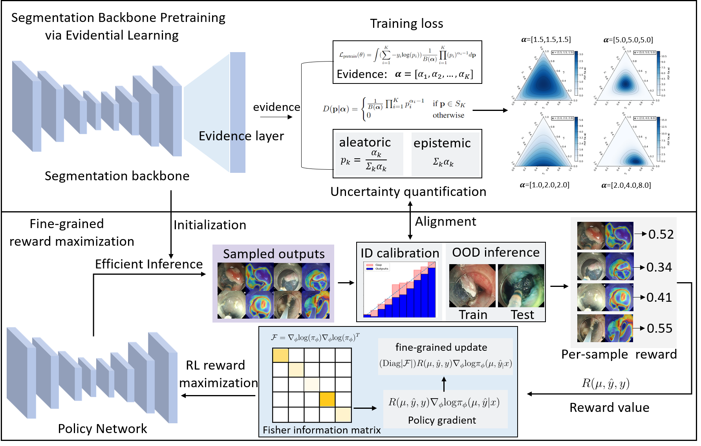

# Uncertainty Estimation for Safety-critical Scene Segmentation via Fine-grained Reward Maximization
Pytorch implementation for Uncertainty Estimation for Safety-critical Scene Segmentation via Fine-grained Reward Maximization, by [Hongzheng Yang](https://github.com/HongZhengYang), [Cheng Chen](https://cchen-cc.github.io/), [Yueyao Chen](https://github.com/YueyaoChenCYY), [Markus Scheppach](),  [Hon Chi Yip](https://www.surgery.cuhk.edu.hk/profile.asp?alias=hcyip), [Qi Dou](http://www.cse.cuhk.edu.hk/~qdou/).  

## Abstract

> Uncertainty estimation plays an important role for future reliable deployment of deep segmentation models in safety-critical scenarios such as medical applications. However, existing methods for uncertainty estimation have been limited by the lack of explicit guidance for calibrating the prediction risk and model confidence. In this work, we propose a novel fine-grained reward maximization (FGRM) framework, to address uncertainty estimation by directly utilizing an uncertainty metric related reward function with a reinforcement learning based model tuning paradigm. This would benefit the model uncertainty estimation with direct optimization guidance for model calibration. Specifically, our method designs a new uncertainty estimation reward function using the calibration metric, which is maximized to fine-tune an evidential learning pre-trained segmentation model for calibrating prediction risk. Importantly, we innovate an effective fine-grained parameter update scheme, which imposes fine-grained reward-weighting of each network parameter according to the parameter importance quantified by the fisher information matrix. To the best of our knowledge, this is the first work exploring reward optimization for model uncertainty estimation for safety-critical vision tasks. The effectiveness of our method is demonstrated on two large safety-critical surgical scene segmentation datasets under two different uncertainty estimation settings. With real-time one forward pass at inference, our method outperforms state-of-the-art methods by a clear margin on all the calibration metrics of uncertainty estimation, while maintaining a high task accuracy for the segmentation results.

## Files structure

In this repository, we provide the implementation of our uncertainty estimation method on CholecSeg8K dataset. The evidential learning implementation were adopted from [TBraTS](https://github.com/cocofeat/tbrats).

To reproduce results on AI-ENDO ESD datasets, please refer to the experiments folder.

## Datasets

The CholecSeg8K dataset can downloaded from [here](https://www.kaggle.com/datasets/newslab/cholecseg8k). You can also download the preprocessed data from this [link](https://mycuhk-my.sharepoint.com/:f:/g/personal/1155184129_link_cuhk_edu_hk/Eq_VZfrXM9BFofvs7fYCs6sBYCzj4VKSOyy819VHe4FjBg?e=sLqD1P).  

For AI-ENDO ESD dataset, access to the human cases is limited now due to ethical regulations. Source code are provided.

## Usage

1. create conda environment
   
       conda create -n FGRM python=3.9
       conda activate FGRM
   
2. Install dependencies:

   1. install pytorch==1.7.0 torchvision==0.9.0 (via conda, recommend)
   2. install the [segmentation_models.pytorch](https://github.com/qubvel/segmentation_models.pytorch) (locally or in the conda env)

3. download the dataset

4. put your pretrained model under appropate path or train the EDL method with run_EDL() 

5. modify the corresponding data path and model path

6. run run_FGRM() to calibrate the model

## Citation

If this repository is useful for your research, please cite:

    @article{2023FGRM,
     title={Uncertainty Estimation for Safety-critical Scene Segmentation via Fine-grained Reward Maximization},
      author={Hongzheng Yang, Cheng Chen, Markus Scheppach, Hon Chi Yip, Qi Dou},
      booktitle={Thirty-seventh Conference on Neural Information Processing Systems (NeurIPS)},
      year={2023}
    }  

### Questions

Please contact 'hzyang05@gmail.com' if you have any questions. 
